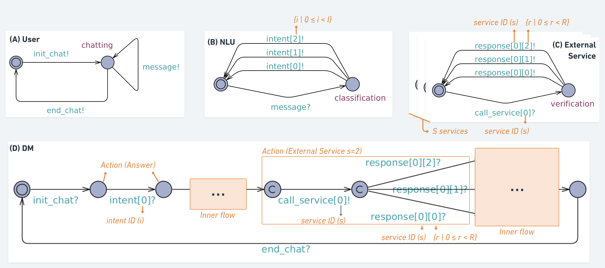

# UPPAAL Base Model

## Enviroment

The following environments were used for development:

**OS**: Ubuntu 22.04  
**UPPAAL**: 4.1.26-1  
**OpenJDK**: 11.0.15  

## Instalation 

Download the UPPAAL executable at the [official page](https://uppaal.org/downloads/).

## Running

1. Run UPPAAL with Java;
2. Open the system (Ctrl+O) selecting the *base.xml* file;
3. Click on "Verifier" tab;
4. Select all properties by holding Ctrl;
5. Click on "Check".

## Files

**base.xml:** holds the automata definition and properties. Select this file when opening the system on UPPAAL.

## Generic Vision

