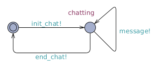
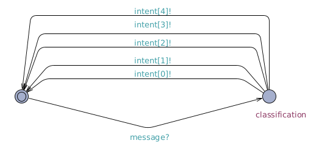
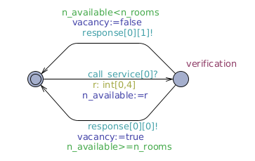
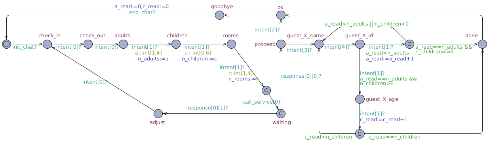

# UPPAAL Model - Hotel Booking Chatbot

## Chatbot Requirements

The requirements refer to a fictional chatbot that books rooms for a hotel. Although the hotel does not exist, the chatbot was designed and implemented in a way that it could be used in a real scenario or it could be expanded to more complex scenarios.

For the hotel, consider as a constraint that there is only one room type, that is, there is no difference among rooms. Consequently, all rooms have a (fictional) standard price per night. 

ID | Requirement 
---|---
R01 | The reservation must have the date of check-in. 
R02 | The reservation must have the date of check-out. 
R03 | The reservation must have at least one adult guest and four at most. 
R04 | The reservation can have up to six children. 
R05 | The reservation must have at least one room to be booked and four at most. 
R06 | The chatbot must call an external service to check for room availability according to the number of rooms requested. 
R07 | The chatbot must ask the user if it can proceed in case there is at least the number of rooms requested, otherwise, it should request the user to adjust registration data. 
R08 | The reservation must have the names and identity numbers of all guests. 
R09 | The reservation must have the age of all children guests. 

## Enviroment

The following environments were used for development:

**OS**: Ubuntu 22.04  
**UPPAAL**: 4.1.26-1  
**OpenJDK**: 11.0.15  

## Instalation 

Download the UPPAAL executable at the [official page](https://uppaal.org/downloads/).

## Running

1. Run UPPAAL with Java;
2. Open the system (Ctrl+O) selecting the *hotel-booking-chatbot.xml* file;
3. Click on "Verifier" tab;
4. Select all properties by holding Ctrl;
5. Click on "Check".

## Files

**hotel-booking-chatbot.xml:** holds the automata definition and properties. Select this file when opening the system on UPPAAL.

## Vision

### User Template

### NLU Template

### Service Template

### DM Template

### Properties

ID | Property | Informal Description | Fulfills 
--- | --- | --- | ---
 P01 | A[] not deadlock | Checks if the automata is free of deadlocks. | - 
 P02 | A<> dm.check_in | Eventually, the chatbot will ask for a check-in date. | R01 
 P03 | A<> dm.check_out | Eventually, the chatbot will ask for a check-out date. | R02 
 P04 | A[] dm.done imply (n_adults>0 \|\| n_adults<=4) | Always the fact that the chatbot finished the reservation implies that the user informed between 1 and 4 adult guests. | R03 
 P05 | A[] dm.done imply (n_children>=0 \|\| n_children<=6) | Always the fact that the chatbot finished the reservation implies that the user informed between 0 and 6 children guests. | R04 
 P06 | A[] dm.done imply (n_rooms>0 \|\| n_rooms<=4) | Always the fact that the chatbot finished the reservation implies that the user informed between 1 and 4 rooms. | R05 
 P07 | rm.verifying --> (dm.proceed \|\| dm.adjust) | Whether the rooms manager is verifying for room availability, eventually the chatbot will ask if it can proceed with the reservation or ask the user to adjust the reservation data. | R06, R07 
 P08 | A[] dm.proceed imply vacancy | Always the fact that the chatbot asked to proceed with the reservation implies that there are rooms available. | R07 
 P09 | A[] dm.adjust imply !vacancy | Always the fact that the chatbot asked for adjusting reservation data implies that there are no rooms available. | R07 
 P10 | A[] dm.adjust imply (n_rooms>n_available) | Always the fact that the chatbot asked for adjusting reservation data implies that the number of requested rooms is less than the number of available rooms.  | R07 
 P11 | A[] dm.proceed imply n_available>=n_rooms | Always the fact that the chatbot asked to proceed with the reservation implies that the number of rooms available is greater or equal than the number of rooms requested. | R07 
 P12 | (dm.waiting \|\| n_rooms>n_available) --> dm.adjust | Whether the chatbot is waiting for the rooms manager response and the number of rooms requested is greater than the number of rooms available, eventually the chatbot will ask the user to adjust the reservation data. | R07 
 P13 | dm.guest_X_name --> dm.done | Whether the chatbot starts collecting guest names, eventually it will finish the reservation. | R08 
 P14 | A[] dm.done imply (c_read==n_children \|\| a_read==n_adults) |  Always the fact that the chatbot finished the reservation implies that the number of children and adults read is equal to the number of children and adults requested, respectively. | R08, R09 
 P15 | A[] dm.guest_X_age imply c_read<n_children | Always the fact that the chatbot is asking for the guest age implies that the number of children read is less than the number of children requested. | R09 

