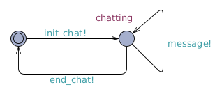
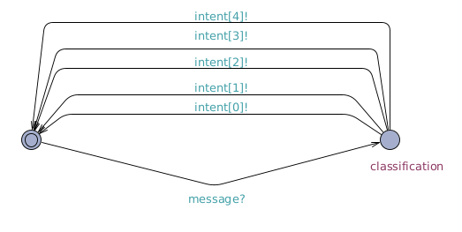
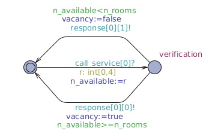
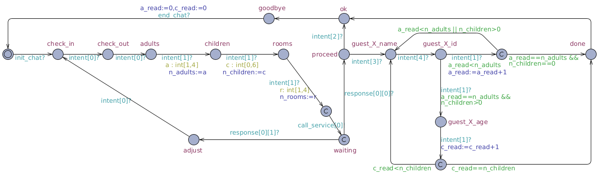

# UPPAAL Model - Hotel Booking Chatbot

## Enviroment

The following environments were used for development:

**OS**: Ubuntu 20.04  
**UPPAAL**: 4.0.15  
**OpenJDK**: 11.0.15  

## Instalation 

Download the UPPAAL executable at the [official page](https://uppaal.org/downloads/).

## Running

1. Run UPPAAL with Java;
2. Open the system (Ctrl+O) selecting the *hotel-booking-chatbot.xml* file;
3. Click on "Verifier" tab;
4. Select all properties by holding Ctrl;
5. Click on "Check".

## Files

**hotel-booking-chatbot.xml:** holds the automata definition. Select this file when opening the system on UPPAAL.

**hotel-booking-chatbot.q:** holds the queries for verification. This file is loaded automatically by loading the *.xml*.

## Vision

### User Template

### NLU Template

### Service Template

### DM Template

### Properties

ID | Property | Informal Description | Fulfills 
--- | --- | --- | ---
 P01 | A[] not deadlock | Checks if the automata is free of deadlocks. | - 
 P02 | A<> dm.check_in | Eventually, the chatbot will ask for a check-in date. | R01 
 P03 | A<> dm.check_out | Eventually, the chatbot will ask for a check-out date. | R02 
 P04 | A[] dm.done imply (n_adults>0 \|\| n_adults<=4) | Always the fact that the chatbot finished the reservation implies that the user informed between 1 and 4 adult guests. | R03 
 P05 | A[] dm.done imply (n_children>=0 \|\| n_children<=6) | Always the fact that the chatbot finished the reservation implies that the user informed between 0 and 6 children guests. | R04 
 P06 | A[] dm.done imply (n_rooms>0 \|\| n_rooms<=4) | Always the fact that the chatbot finished the reservation implies that the user informed between 1 and 4 rooms. | R05 
 P07 | rm.verifying --> (dm.proceed \|\| dm.adjust) | Whether the rooms manager is verifying for room availability, eventually the chatbot will ask if it can proceed with the reservation or ask the user to adjust the reservation data. | R06, R07 
 P08 | A[] dm.proceed imply vacancy | Always the fact that the chatbot asked to proceed with the reservation implies that there are rooms available. | R07 
 P09 | A[] dm.adjust imply !vacancy | Always the fact that the chatbot asked for adjusting reservation data implies that there are no rooms available. | R07 
 P10 | A[] dm.adjust imply (n_rooms>n_available) | Always the fact that the chatbot asked for adjusting reservation data implies that the number of requested rooms is less than the number of available rooms.  | R07 
 P11 | A[] dm.proceed imply n_available>=n_rooms | Always the fact that the chatbot asked to proceed with the reservation implies that the number of rooms available is greater or equal than the number of rooms requested. | R07 
 P12 | (dm.waiting \|\| n_rooms>n_available) --> dm.adjust | Whether the chatbot is waiting for the rooms manager response and the number of rooms requested is greater than the number of rooms available, eventually the chatbot will ask the user to adjust the reservation data. | R07 
 P13 | dm.guest_X_name --> dm.done | Whether the chatbot starts collecting guest names, eventually it will finish the reservation. | R08 
 P14 | A[] dm.done imply (c_read==n_children \|\| a_read==n_adults) |  Always the fact that the chatbot finished the reservation implies that the number of children and adults read is equal to the number of children and adults requested, respectively. | R08, R09 
 P15 | A[] dm.guest_X_age imply c_read<n_children | Always the fact that the chatbot is asking for the guest age implies that the number of children read is less than the number of children requested. | R09 

